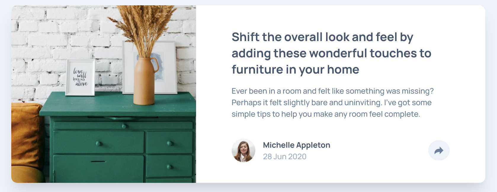
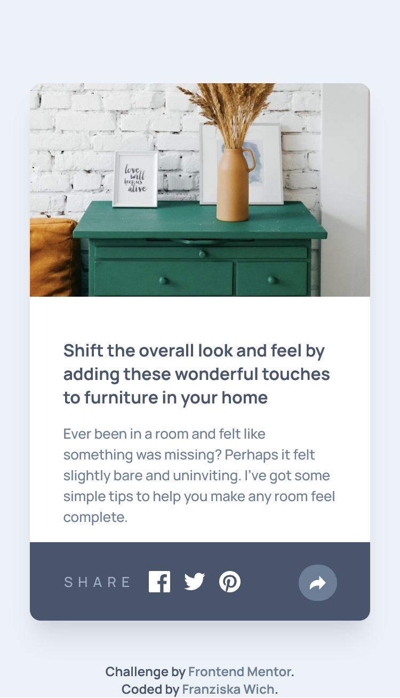

# Frontend Mentor - Article preview component solution

This is a solution to the [Article preview component challenge on Frontend Mentor](https://www.frontendmentor.io/challenges/article-preview-component-dYBN_pYFT). Frontend Mentor challenges help you improve your coding skills by building realistic projects.

## Table of contents

- [Overview](#overview)
  - [The challenge](#the-challenge)
  - [Screenshots](#screenshot)
  - [Links](#links)
- [My process](#my-process)
  - [Built with](#built-with)
  - [What I learned](#what-i-learned)
  - [Continued development](#continued-development)
  - [Useful resources](#useful-resources)
- [Author](#author)

## Overview

### The challenge

Users should be able to:

- View the optimal layout for the component depending on their device's screen size
- See the social media share links when they click the share icon

### Screenshots




### Links

- Solution URL: [https://github.com/franziskawich/article-preview-component/](https://github.com/franziskawich/article-preview-component/)
- Live Site URL: [https://franziskawich.github.io/article-preview-component/](https://franziskawich.github.io/article-preview-component/)

## My process

### Built with

- Semantic HTML5 markup
- SCSS (saved as CSS)
- JavaScript
- Flexbox
- Mobile-first workflow

### What I learned

I learned that I can change how an image is cropped with the help of object-position.

```css
img {
  object-fit: cover;
  object-position: 0% 25%;
}
```

This is my first challenge with some JavaScript. At first I hade two separate share buttons, but it made more sense to change the background-color with JS in the end. Unexpectedly the JS part was easy compared to the rest of the challenge.

### Continued development

I wanted to include the possibility to close the share element by clicking outside the share element but this seems to complicated for me (for now). 😐

It is probably barely visible, but the small triangle pseudo-element on larger devices does not have a box-shadow as the rest of the element. I tried adding the shadow, but somehow the stacking of z-indexes did not work. I recreated the problem on CodePen and it worked fine, but I could not figure out how to apply my solution there to this challenge. Idk, this frustrated me more than it should.

The property overflow: visible; on my container was not ideal, I assume. Otherwise my share element was cut off, but now I had to set the border-radius for my image two times.

I had a lot of trouble with the share element to make it look like it does in the design. This took way longer than I thought. The tablet version was one of the problems I had. I did not use fixed widths to make my solution more responsive, but that way the share element did not stay at the same position. I used media queries and a slightly different design of the element to get an acceptable result.

### Useful resources

- [Stack Overflow: How to change the color of an svg element?](https://stackoverflow.com/questions/22252472/how-to-change-the-color-of-an-svg-element) - This helped me changing the color of my svg.
- [CSS-Tricks: The Shapes of CSS](https://css-tricks.com/the-shapes-of-css/) - This helped with my triangle pseudo element for the tablet version.

## Author

- Frontend Mentor - [@franziskawich](https://www.frontendmentor.io/profile/franziskawich)
- freeCodeCamp - [Franziska Wich](https://www.freecodecamp.org/fcc35fab9df-6b8c-445e-8aec-36ee00e99ba0)
